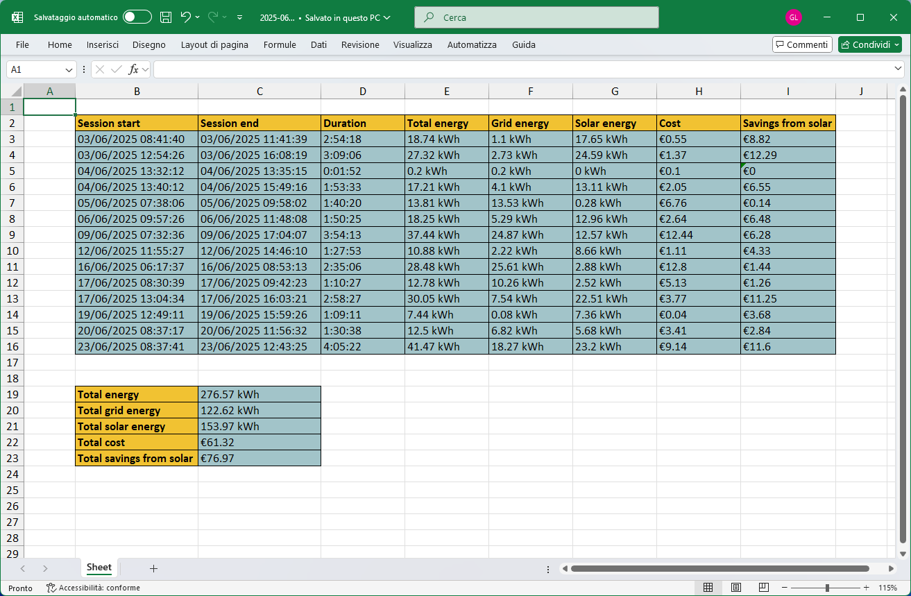

# Wallbox Report Generator
A Python tool that retrieves EV charging sessions from myWallbox.com and generates a structured XLSX report. You can customizable the time time range of the sessions to retrive and optionally include a summary with total energy consumption and costs.

This tool uses the [Wallbox](https://pypi.org/project/wallbox) library by [cliviu74](https://github.com/cliviu74) to fetch data from the official API, and outputs the formatted results into an XLSX spreadsheet using the [OpenPyXl](https://pypi.org/project/openpyxl) library.



## Table of Contents
  - [Installation](#installation)
  - [Usage](#usage)
  - [Why](#why)
  - [How is the cost calculated?](#how-is-the-cost-calculated)
  - [I have more than one charger, what do I do?](#i-have-more-than-one-charger-what-do-i-do)
  - [Things that can be improved](#things-that-can-be-improved)


## Installation
Assuming you have Python 3 installed, you just need to clone the repo and install the requirements using pip.

```bash
git clone https://github.com/leonardogovoni/wallbox-report-generator.git
cd wallbox-report-generator
pip install -r requirements.txt
```

## Usage
```
usage: wallbox-report-generator [-h] -u USER -p PASSWORD [-c CHARGER_ID] [-m MONTH] [-y YEAR] [--full-year] [-o OUTPUT] [-s] [-it]

options:
  -h, --help            show this help message and exit
  -u, --user USER       Your myWallbox.com username
  -p, --password PASSWORD
                        Your myWallbox.com password
  -c, --charger-id CHARGER_ID
                        Charger ID to generate the report for; required if you have multiple chargers associated
  -m, --month MONTH     Month for the report; defaults to the current month if not specified
  -y, --year YEAR       Year for the report; defaults to the current year if not specified
  --full-year           Generate a report for the entire year instead of a single month
  -o, --output OUTPUT   Output file name; defaults to YYYY-MM.xlsx or YYYY.xlsx if not specified
  -s, --summary         Include a summary at the end of the table with stats like total energy charged etc.
  -it, --italian        Use Italian language for descriptions and table headings in the report
```

## Why
I am aware that myWallbox.com already allows you to export reports of your charging sessions for a specific time range, however I find this tool much simpler and convenient since it only requires a single command. Being a CLI tool it’s also easy to automate with other scripts or workflows.

I also find the official report somewhat lacking; at least in my case it doesn’t show important data like how much energy came from the grid versus solar, an information that they have since it's shown in the app on my phone. This tool retrieves data directly from the API, making that information accessible.

## How is the cost calculated?
The cost per session is calculated by Wallbox and exposed through their API. This script does not perform any cost computations, it simply retrieves and reports the values provided. 
To ensure accurate cost calculations, configure your electricity rate ($/kWh) in the charger settings via the app or the website.

## I have more than one charger, what do I do?
In the future I’ll likely implement a way to select the desired charger directly from the tool, but for now you need to specify its ID manually. To do this, go to [myWallbox.com](https://mywallbox.com) and open the chargers page. In the list, each charger should display its serial number next to its name. Copy the serial number and pass it to the script using the `-c <serial>` parameter.

## Things that can be improved
This script was originally made just for me, to see how much my parents' EV was helping us save money by charging it with solar energy — but it's still far from perfect for general use.

Here are some ideas that could significantly improve the usability and overall quality of the script:
- When multiple chargers are associated with the account:
  - List their IDs directly from the tool, without requiring access to the website
  - Optionally export a report that includes data from all chargers
- The date format is currently hardcoded and it doesn't follow the formatting conventions 
- Add support for exporting to CSV files
- Add an option to generate a full-year report with a separate sheet for each month, rather than a single sheet with all sessions

Contributions are very welcome, feel free to open an issue or submit a pull request.